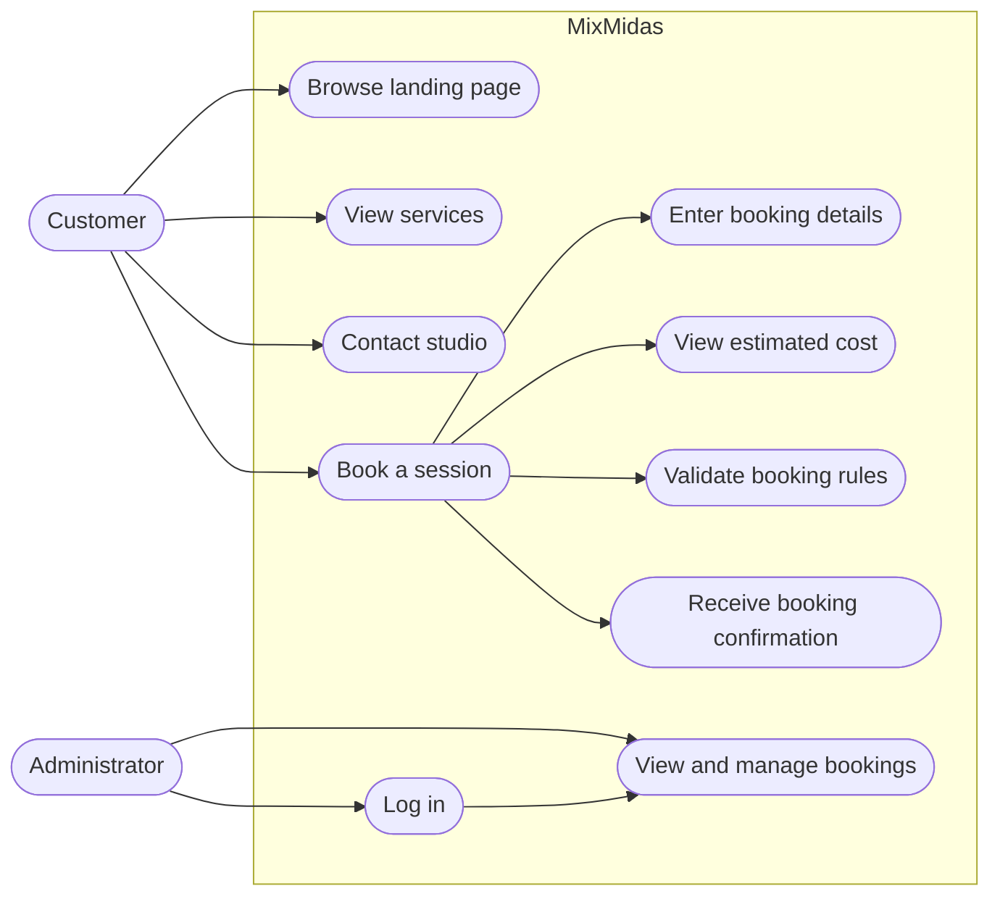
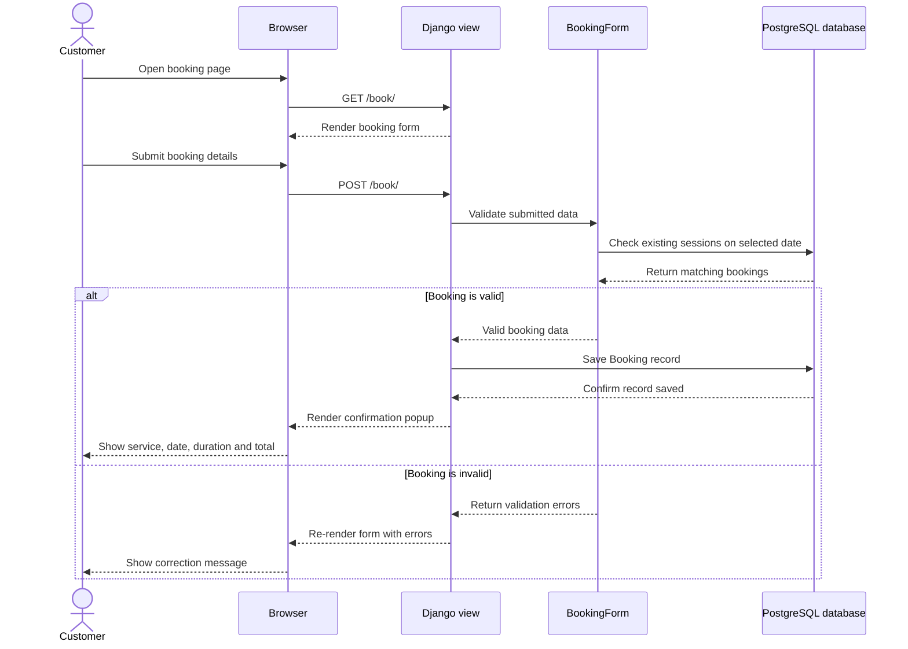
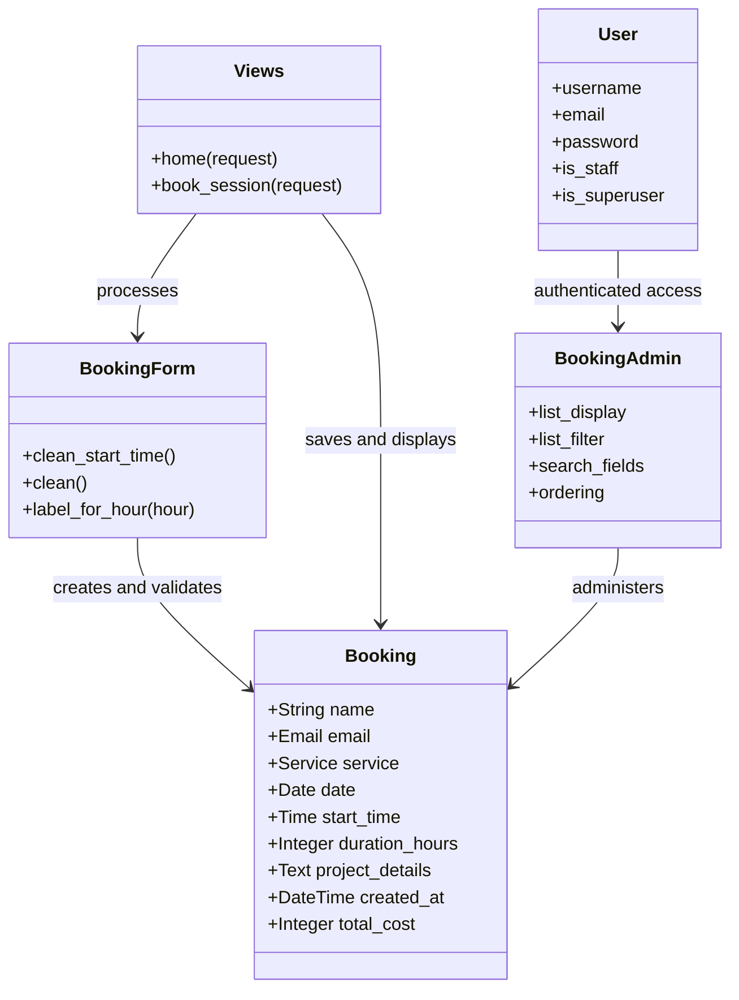

# MixMidas Project Diagrams

## 1. Use-case diagram

**Description:** Customers can explore the site, contact MixMidas, and make a booking. A booking requires customer details, service, date, start time, and duration. The system calculates the cost at ₦10,000 per hour and validates that the session is within 10 AM–6 PM, is not in the past, and does not overlap another session. An administrator logs into Django administration to view and manage stored bookings.

## 2. Sequence diagram

**Description:** The customer opens the booking page and submits the form. Django passes the submitted details to `BookingForm`, which applies the service-hour and scheduling rules and queries the database for time conflicts. A valid booking is stored and the customer sees a confirmation modal. Invalid input returns to the same form with an explanation.

## 3. Class diagram

**Description:** `Booking` is the central database model and stores every customer session. `BookingForm` creates the booking form and contains the scheduling validation rules. The view functions display the landing page, process booking submissions, and show confirmation details. `BookingAdmin` exposes booking records in Django administration. Django’s `User` model controls administrator authentication and access to the booking records.
